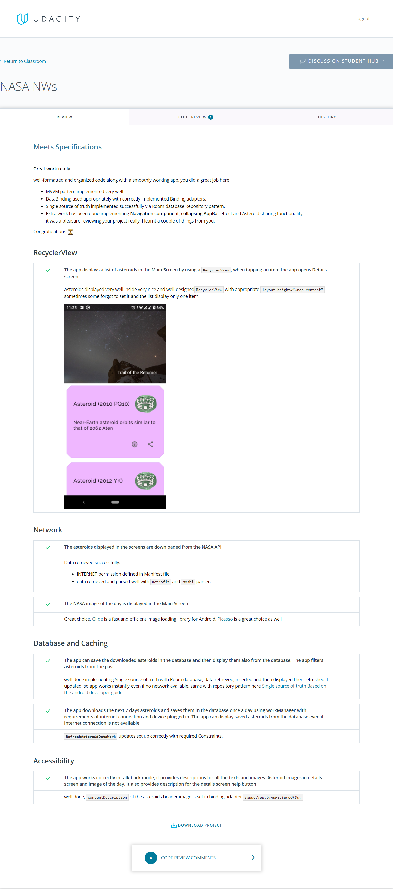

# Near-Earth Asteroids App Project

## Project Overview

Near-Earth Asteroids app is the second project in the Android Kotlin Nanodegree Program from Udacity, it showcases data related to Near-Earth objects provided para NeoWs API provided by [Nasa APIs](https://api.nasa.gov/).

Also it showcases daily astronomy pictures of the day, also provided by [Nasa APIs](https://api.nasa.gov/).

## Project Specification

### RecyclerView

| CRITERIA       | MEETS SPECIFICATIONS |
| :------------- | :---------- |
| Create and reuse views in an Android app using `RecyclerView` | The app displays a list of asteroids in the Main Screen by using a `RecyclerView`, when tapping an item the app opens Details screen. |

### Network

| CRITERIA       | MEETS SPECIFICATIONS |
| :------------- | :---------- |
| Build an application that connects to an internet server to retrieve and display live data | The asteroids displayed in the screens are downloaded from the NASA API |
| Use networking and image best practices to fetch data and images | The NASA image of the day is displayed in the Main Screen |

### Database and Caching

| CRITERIA       | MEETS SPECIFICATIONS |
| :------------- | :---------- |
| Create a database to store and access user data over time | The app can save the downloaded asteroids in the database and then display them also from the database. The app filters asteroids from the past |
| Implement offline caching to allow users to interact with online content offline | The app downloads the next 7 days asteroids and saves them in the database once a day using workManager with requirements of internet connection and device plugged in. The app can display saved asteroids from the database even if internet connection is not available |

### Accessibility

| CRITERIA       | MEETS SPECIFICATIONS |
| :------------- | :---------- |
| Add talkback and push-button navigation to make an Android app accessible | The app works correctly in talk back mode, it provides descriptions for all the texts and images: Asteroid images in details screen and image of the day. It also provides description for the details screen help button |

### Suggestions applied

1. Modify the app to support multiple languages, device sizes and orientations.
    - Application supports language as English, Spanish and Portuguese/BR
    - Applications adapts its layout to landscape and portrait orientations accordingly
2. Provide styles for the details screen subtitles and values to make it consistent, and make it look like in the designs.
    - Application applies theming, styling, typography and coloring from Materil Design best practices

## Showcase

<div>
    
    
    
</div>
<div>
    
    
    
</div>

## Live Running

<a href="https://appetize.io/app/rrub0zdqvurm5bzmbj3cupndb8?device=pixel4&scale=75&orientation=portrait&osVersion=10.0&deviceColor=black&autoplay=true" target="_blank"></a>

## Project reviews

- [Review #4](https://review.udacity.com/?utm_campaign=ret_000_auto_ndxxx_submission-reviewed&utm_source=blueshift&utm_medium=email&utm_content=reviewsapp-submission-reviewed&bsft_clkid=69bf4b42-d5a5-4b58-a0be-9a7c6d437137&bsft_uid=41fbbe1d-caad-4775-b74e-f4848e660feb&bsft_mid=02c5ba49-3eac-4824-ad58-72ff51bfed98&bsft_eid=6f154690-7543-4582-9be7-e397af208dbd&bsft_txnid=dc051262-557f-47fe-8885-198d9a927cae&bsft_link_id=2&bsft_mime_type=html&bsft_ek=2020-12-31T21%3A28%3A23Z&bsft_aaid=8d7e276e-4a10-41b2-8868-423fe96dd6b2&bsft_lx=2&bsft_tv=5#!/reviews/2671186)



- [Review #3](https://review.udacity.com/?utm_campaign=ret_000_auto_ndxxx_submission-reviewed&utm_source=blueshift&utm_medium=email&utm_content=reviewsapp-submission-reviewed&bsft_clkid=69bf4b42-d5a5-4b58-a0be-9a7c6d437137&bsft_uid=41fbbe1d-caad-4775-b74e-f4848e660feb&bsft_mid=02c5ba49-3eac-4824-ad58-72ff51bfed98&bsft_eid=6f154690-7543-4582-9be7-e397af208dbd&bsft_txnid=dc051262-557f-47fe-8885-198d9a927cae&bsft_link_id=2&bsft_mime_type=html&bsft_ek=2020-12-31T21%3A28%3A23Z&bsft_aaid=8d7e276e-4a10-41b2-8868-423fe96dd6b2&bsft_lx=2&bsft_tv=5#!/reviews/2668307)

- [Review #2](https://review.udacity.com/?utm_campaign=ret_000_auto_ndxxx_submission-reviewed&utm_source=blueshift&utm_medium=email&utm_content=reviewsapp-submission-reviewed&bsft_clkid=69bf4b42-d5a5-4b58-a0be-9a7c6d437137&bsft_uid=41fbbe1d-caad-4775-b74e-f4848e660feb&bsft_mid=02c5ba49-3eac-4824-ad58-72ff51bfed98&bsft_eid=6f154690-7543-4582-9be7-e397af208dbd&bsft_txnid=dc051262-557f-47fe-8885-198d9a927cae&bsft_link_id=2&bsft_mime_type=html&bsft_ek=2020-12-31T21%3A28%3A23Z&bsft_aaid=8d7e276e-4a10-41b2-8868-423fe96dd6b2&bsft_lx=2&bsft_tv=5#!/reviews/2668305)

- [Review #1](https://review.udacity.com/?utm_campaign=ret_000_auto_ndxxx_submission-reviewed&utm_source=blueshift&utm_medium=email&utm_content=reviewsapp-submission-reviewed&bsft_clkid=69bf4b42-d5a5-4b58-a0be-9a7c6d437137&bsft_uid=41fbbe1d-caad-4775-b74e-f4848e660feb&bsft_mid=02c5ba49-3eac-4824-ad58-72ff51bfed98&bsft_eid=6f154690-7543-4582-9be7-e397af208dbd&bsft_txnid=dc051262-557f-47fe-8885-198d9a927cae&bsft_link_id=2&bsft_mime_type=html&bsft_ek=2020-12-31T21%3A28%3A23Z&bsft_aaid=8d7e276e-4a10-41b2-8868-423fe96dd6b2&bsft_lx=2&bsft_tv=5#!/reviews/2656822)

### Code Review

<div>
    
</div>
<div>
    
</div>
<div>
    
</div>
<div>
    
</div>
<div>
    
</div>
<div>
    
</div>

## Libraries Used

- [Jetpack Foundation](https://developer.android.com/jetpack/components) - Components for core system capabilities, Kotlin extensions and support for multidex and automated testing.
    - [AppCompat](https://developer.android.com/topic/libraries/support-library/packages#v7-appcompat) - Degrade gracefully on older versions of Android.
    - [Android KTX](https://developer.android.com/kotlin/ktx) - Write more concise, idiomatic Kotlin code.
- [Architecture](https://developer.android.com/jetpack/arch/) - A collection of libraries that help you design robust, testable, and maintainable apps. Start with classes for managing your UI component lifecycle and handling data persistence.
    - [Data Binding](https://developer.android.com/topic/libraries/data-binding/) - Declaratively bind observable data to UI elements.
    - [Lifecycles](https://developer.android.com/topic/libraries/architecture/lifecycle) - Create a UI that automatically responds to lifecycle events.
    - [LiveData](https://developer.android.com/topic/libraries/architecture/livedata) - Build data objects that notify views when the underlying database changes.
    - [Navigation](https://developer.android.com/topic/libraries/architecture/navigation/) - Handle everything needed for in-app navigation.
    - [Room](https://developer.android.com/topic/libraries/architecture/room) - Access your app's SQLite database with in-app objects and compile-time checks.
    - [ViewModel](https://developer.android.com/topic/libraries/architecture/viewmodel) - Store UI-related data that isn't destroyed on app rotations. Easily schedule asynchronous tasks for optimal execution
    - [WorkManager](https://developer.android.com/topic/libraries/architecture/workmanager) - Manage your Android background jobs.
- [UI](https://developer.android.com/guide/topics/ui) - Details on why and how to use UI Components in your apps - together or separate
    - [Fragment](https://developer.android.com/guide/components/fragments) - A basic unit of composable UI.
    - [Browser](https://developer.android.com/jetpack/androidx/releases/browser) - Display webpages in the user's default browser
    - [Constraintlayout](https://developer.android.com/jetpack/androidx/releases/constraintlayout) - Position and size widgets in a flexible anf efficient way with relative positioning
    - [Material Components for Android](https://github.com/material-components/material-components-android) - Material Design toolkit to design and code high-quality digital experiences
- Third party and miscellaneous libraries
    - [Glide](https://bumptech.github.io/glide/) for image loading
    - [Kotlin Coroutines](https://kotlinlang.org/docs/reference/coroutines-overview.html) for managing background threads with simplified code and reducing needs for callbacks
    - [Retrofit 2](https://square.github.io/retrofit/) - A type-safe HTTP client for Android and Java
    - [OkHttp 3](https://square.github.io/okhttp/) - OkHttp is an HTTP client that’s efficient by default:
        - HTTP/2 support allows all requests to the same host to share a socket.
        - Connection pooling reduces request latency (if HTTP/2 isn’t available).
        - Transparent GZIP shrinks download sizes.
        - Response caching avoids the network completely for repeat requests.
    - [Moshi](https://github.com/square/moshi/) - Moshi is a modern JSON library for Android and Java. It makes it easy to parse JSON into Java objects
    - [Facebook Shimmer](https://github.com/facebook/shimmer-android) - An easy, flexible way to add a shimmering effect to any view in an Android app
    - [Timber](https://github.com/JakeWharton/timber) - A logger with a small, extensible API which provides utility on top of Android's normal Log class

## Getting Started

### Development Environment

The app is written entirely in Kotlin and uses the Gradle build system.

To build the app, use the gradlew build command or use "Import Project" in Android Studio.

### Android Studio IDE setup

For development, the latest version of Android Studio is required. The latest version can be downloaded from [here](https://developer.android.com/studio/).

### Architecture

The architecture is built around [Android Architecture Components](https://developer.android.com/topic/libraries/architecture/).

Near-Earth Asteroids follows the recommendations laid out in the [Guide to App Architecture](https://developer.android.com/jetpack/docs/guide) when deciding on the architecture for the app. We kept logic away from Activities and Fragments and moved it to [ViewModels](https://developer.android.com/topic/libraries/architecture/viewmodel). We observed data using [LiveData](https://developer.android.com/topic/libraries/architecture/livedata) and used the [Data Binding Library](https://developer.android.com/topic/libraries/data-binding/) to bind UI components in layouts to the app's data sources.

Near-Earth Asteroids uses a Repository layer for handling data operations. Data comes from NASA API sources.

Near-Earth Asteroids uses [Navigation component](https://developer.android.com/guide/navigation) to simplify into a single Activity app.

Near-Earth Asteroids uses [Room](https://developer.android.com/jetpack/androidx/releases/room) for persistance layer and ORM modelling.

Near-Earth Asteroids uses [WorkManager](https://developer.android.com/jetpack/androidx/releases/work) to performance long-running tasks as such the initial dataset loading and daily fetches of new data available from NeoWs API.

### Firebase

The app makes considerable use of the following Firebase components:

- [Firebase Crashlytics](https://firebase.google.com/products/crashlytics) helps you track, prioritize, and fix stability issues that erode app quality, in realtime. Spend less time triaging and troubleshooting crashes and more time building app features that delight users.
- [Firebase Performance Monitoring](https://firebase.google.com/products/performance) to get insights into how your app performs from your users’ point of view, with automatic and customized performance tracing.

You need to create a [Firebase account](https://firebase.google.com/) and [setup Firebase](https://firebase.google.com/docs/android/setup) in the project.

It's important to complete the configuration and add a Firebase configuration file, which is `google-services.json` into the module (app-level) directory of the app.

### Nasa API key

Near-Earth Asteroids uses the [Nasa APIs](https://api.nasa.gov/) to load near earth Asteroid information and astronomy picture of the day. To use the API, you will need to obtain a free developer API key. See the [Nasa API portal](https://api.nasa.gov/#signUp) for instructions.

Once you have the key, add this line to the gradle.properties file, either in your user home directory (usually ~/.gradle/gradle.properties on Linux and Mac) or in the project's root folder:

```
nasa_api_key=<your NASA access key>
```

### Bugsnag API Key

Near-Earth Asteroids uses the [Bugsnag](https://bugsnag.com) to monitors application stability so we can make data-driven decisions on whether we should be building new features, or fixing bugs. To use the API, you will need to obtain a free developer API key. See the [Bugsnag site](https://app.bugsnag.com/user/new/) for instructions.

Once you have the key, add this line to the gradle.properties file, either in your user home directory (usually ~/.gradle/gradle.properties on Linux and Mac) or in the project's root folder:

```
bugsnag_api_key=<your Bugsnag access key>
```